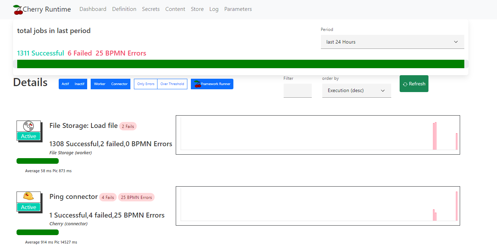
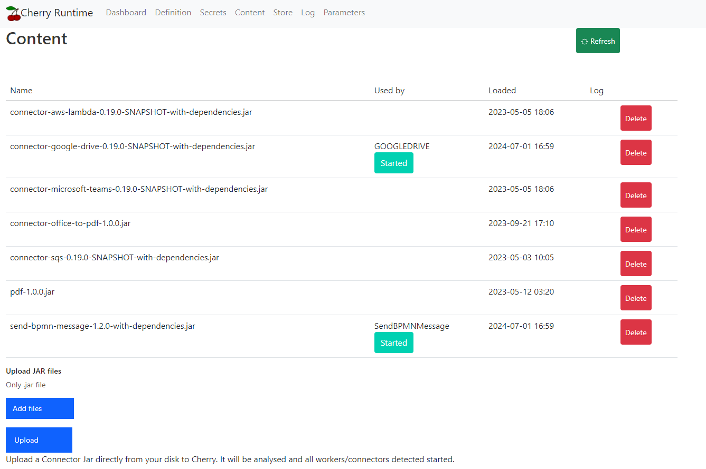
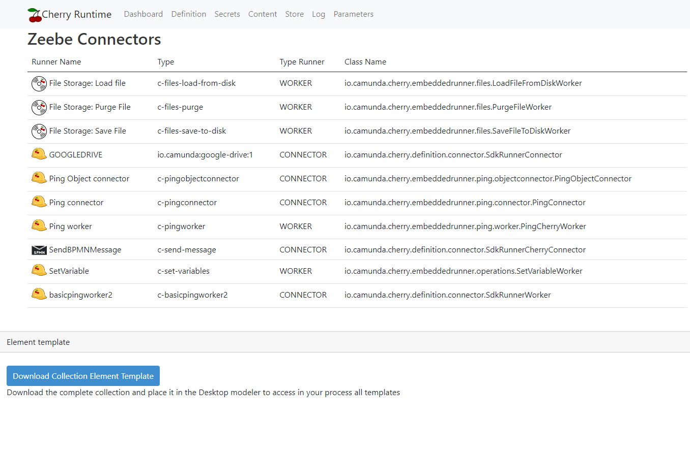
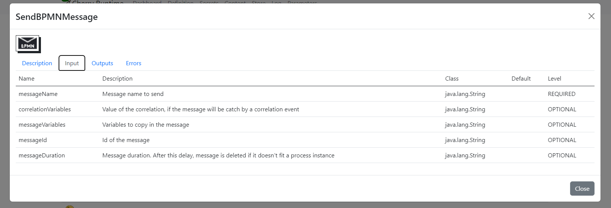

[](https://github.com/Camunda-Community-Hub/community/blob/main/extension-lifecycle.md#incubating-)
[](https://github.com/camunda-community-hub/community)


# What is the Cherry Runtime?

The Cherry Runtime is dedicated to executing Camunda 8 Connectors and Workers.
It provides administrative pages to administrators and business developers.


The Cherry runtime accepts any OUTBOUND connector. The definition can be downloaded from the MarketPlace or any GitHub repository (SOON).
It provides an Administrator page where
* a connector can be stop/start
* execution statistics are available to size the cluster: Are multiple runtimes necessary to handle the load?


This documentation gives information:
* for administrators to start and administrate a Collection
* for BPM Designer, to access documentation and download Element-Template in your modeler
* For developers, which information can be added during the development, to propose more information for administrators and BPM Designer


# Administrator
Any connectors OUTBOUND can be executable by the runtime. INBOUND connectors are not supported for the moment.

A connector can be available:
* as a JAR file, downloaded from a GitHub repository
* from the Camunda Marketplace. Then, it's possible to access the JAR file or to download the connector directly from the Cherry administration page (SOON)

What do you need to do to start the runtime?

Check the [Installation guide](doc/InstallationGuide/README.md) for more information.

Check the [Administration guide.md](doc/AdministrationGuide%2FREADME.md) for explanation on functions available.

In a short overview, to enable a Cherry runtime in your cluster:

## Download the application

Download the Docker Image, or use the docker-compose given in the [docker-Cherry](docker-cherry/README.md)
The image is available here.

```
ghcr.io/camunda-community-hub/zeebe-cherry-runtime:latest
````

## Configure the application

Cherry needs:
* to connect to Zeebe to get jobs
* to save connectors and statistics

Check the [application.yaml](src/main/resources/application.yaml) file to see all parameters.
It is possible to pass parameters as a variable, for example.

``
environment:
- ZEEBE_CLIENT_BROKER_GATEWAY_ADDRESS=zeebe:26500
  ``
  To connect a local engine in the same cluster.

An H2 database is configured by default to save information. Use a SQL database for a robust database.
Looks [docker-compose-cherry-postgres.yaml](docker-cherry/docker-compose-cherry-postgres.yaml) to see an example.

Using an SQL database allows you to configure not only one Cherry pod but a farm of pods. Each pod accesses the same database, and through Connectors, statistics are shared between all pots.

## Start the application

Start the application, and check the main page. The port number is 9081 by default in the application.yaml file



On this page, connectors/workers are visible with statistics. The administrator can stop a connector/worker
and change the number of threads dedicated to the execution pool.

## Loads connectors

Connect to the Administration page and navigate to the `Content` page. Upload a JAR file via the page.




# BPMN Designer
Connectors can be accessible via the Cherry `Definition` page.

Multiple functions are available if the connectors come from the marketplace or implement the Cherry additional methods.

##  Documentation

Access the `Definition` page


Click on a connector.
Different tabs are visible.
If the connector defines the additional Cherry method, Inputs, Outputs, and Errors are visible in the tab.




## Element template

The element template can be downloaded if the connector defines the additional Cherry methods or comes from the MarketPlace.

Open the ZIP file, and upload content on the Desktop modeler, path `resources\element-templates.


It's possible to upload the file on the Web Modeler.

# For the Developer

Cherry runtime can run any connector.
The connector must include some extra methods to allow the Business Developers to access new functions, like the documentation.

The second advantage of implementing this method is element-template generation.
When Inputs and Outputs are explained, the Cherry runtime can generate the element template and hide the complexity.

Cherry runtime has more critical features for the developers:
* The Cherry runtime controls the contract. If a variable is mandatory, the Framework controls its existence. On the Execute() method, the developer does not need to worry about the variable.
* if the connector declares a BPMN Error, the glue between the code and the throw is taken in charge by the Cherry runtime.

The Cherry runtime manages execution, and many administrative functions are included: starting/stopping, changing the number of threads, and getting statistics on execution.

Check the [Developer guide](doc/DeveloperGuide%2FREADME.md)


# Internal tip

## Create the Docker image
Because the library contains Java and React script, to deploy it, the machine must have two environments

.github/workflows/mvn-build.yml


`````yaml
    - name: Set up JDK
      uses: actions/setup-java@v3
      with:
          java-version: '17'
          distribution: 'adopt'
    - name: Set up NPM
      uses: actions/setup-node@v3

    - name: Build with Maven
      run:  CI=false mvn --batch-mode --update-snapshots package
`````

CI=false, else any warning will stop the construction.

The docker image is then available in the package
`https://github.com/camunda-community-hub/zeebe-cherry-runtime/pkgs/container/zeebe-cherry-runtime`


# Build
The project is configured to publish the JAR file automatically to Maven Central and to docker package a Docker image.

If you want to build a local maven image, use

````yaml
mvn spring-boot:build-image
````
## Maven Central repository

See .github/workflows/mvn-release.yml


Visit
https://github.com/camunda-community-hub/community-action-maven-release/tree/main
