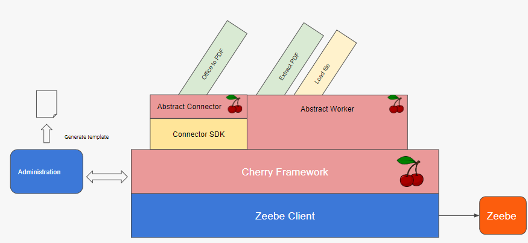
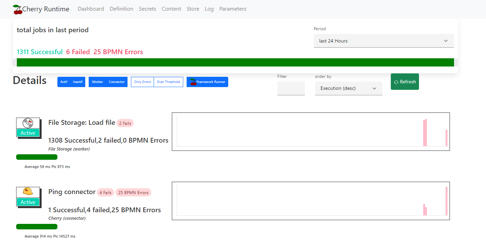
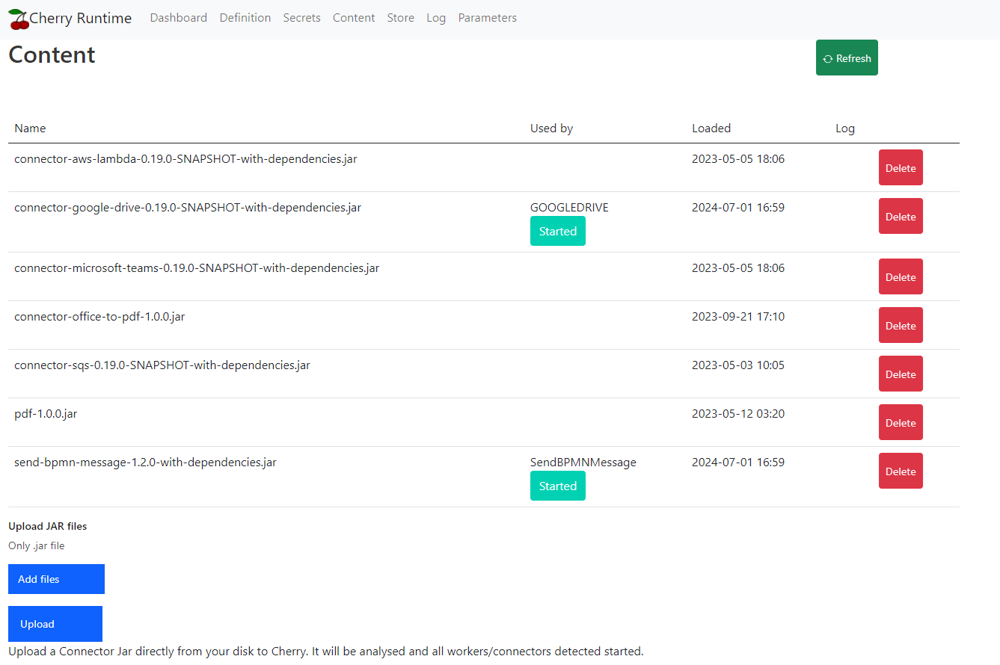
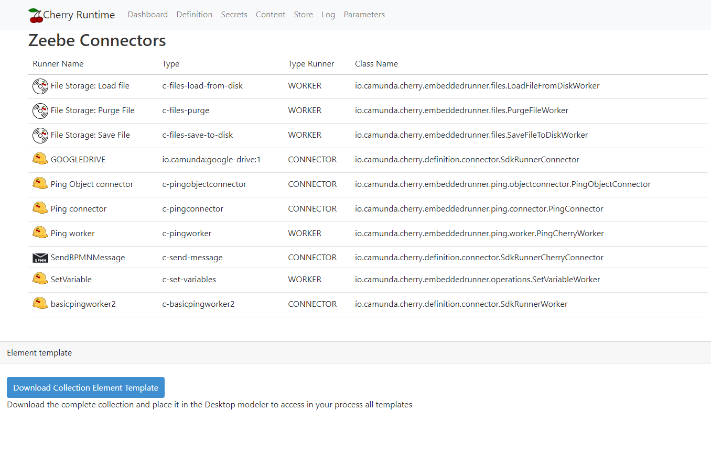
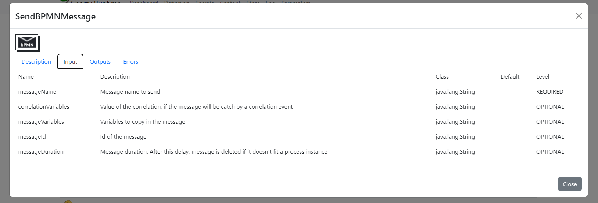
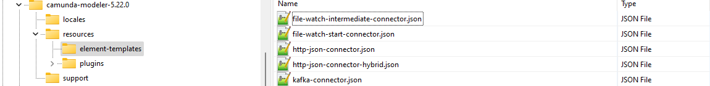

[](https://github.com/Camunda-Community-Hub/community/blob/main/extension-lifecycle.md#incubating-)
[](https://github.com/camunda-community-hub/community)


# What is the Cherry Runtime?

The Cherry Runtime is dedicated to executing Camunda 8 Connectors and Workers.

It provides
* Administrative pages
  * to monitor the activity of connectors/workers: speed, number of executions
  * To stop/restart the execution

* A connector can be uploaded
  * From the UI,
  * From a shared folder
  * Download it from the marketplace or a GitHub repository (soon)

* Element template can be downloaded

* A farm of runtime, all are managed from one single page

* For developpers, a library is available to generate element-templates for Connectors and Workers



The Cherry runtime accepts any OUTBOUND connector.


This documentation gives information:
* for administrators to start and administrate connector
* for BPM Designer, to access documentation and download Element-Template in your modeler
* For developers, which information can be added during the development, to propose more information for administrators and BPM Designer


# Installation


## Download the application

Download the Docker Image, or use the docker-compose given in the [docker-Cherry](docker/README.md)
The image is available here.

```
ghcr.io/camunda-community-hub/zeebe-cherry-runtime:latest
````

## Configure the application

Cherry needs:
* to connect to Zeebe to get jobs
* to save connectors and statistics

Check the [application.yaml](src/main/resources/application.yaml) file to see all parameters.

The connection use this approach https://github.com/camunda-community-hub/spring-zeebe?tab=readme-ov-file#configuring-camunda-8-connection

### Saas
Use
```yaml
camunda:
  client:
    mode: saas
    auth:
      client-id: <your client id>
      client-secret: <your client secret>
    cluster-id: <your cluster id>
    region: <your cluster region>
```

### Self-manage without Identity

```yaml
camunda:
  client:
    mode: simple
    auth:
      username: demo
      password: demo
    zeebe:
      enabled: true
      gateway-url: http://localhost:26500
      base-url: http://localhost:8080
      prefer-rest-over-grpc: false
```

### Self-manage with Identity

````yaml
camunda:
  client:
    mode: oidc
    auth:
      client-id: <your client id>
      client-secret: <your client secret>
    zeebe:
      enabled: true
      gateway-url: http://localhost:26500
      base-url: http://localhost:8080
      prefer-rest-over-grpc: false
````

### Use parameters
It is possible to pass parameters as a variable, for example.

``
Environment:
- CAMUNDA_CLIENT_MODE=saas
  ``
  To connect a local engine in the same cluster.


## Database

An H2 database is configured by default to save information. Use a SQL database for a robust database.
Looks [docker-compose-cherry-postgres.yaml](docker/docker-compose-cherry-postgres.yaml) to see an example.

Using an SQL database allows you to configure one Cherry pod and a farm of pods. Each pod accesses the same database, and statistics are shared between all pots through connectors.

## Store

Explain the context, that connector can be downloaded from store

## Direct download

Explore the configuration to explain how a connector/worker can be uploaded from an htpp url

## Connector runtime
give link to see all connectors, and show how to use "access" and "startup" to download at startup and filter at startup


## Community hub connector
give communityu link to see all connectors, and show how to use "access" and "startup" to download at startup and filter at startup. Explain the filter to detect a connector in the community: a folder "element-template" or the usage of a camunda client library in the pom.xml is sufficient to start the detection


## Private store
Explain how to access the repository

### Github section
Explain the token configuration to let goithub access all repo. 
Connector and community does not need a token but if not provided, API is limited


## Folder upload

Explain that jar file place under configuiration "cherry.connectorslib.uoloadpath" (default is `localstorage/upload`) are uploaded at startup. So explain how, in a kubernetes, a config map can be connector to that path to upload from the config map


## Start the application

Start the application, and check the main page. The port number is 9081 by default in the application.yaml file



On this page, connectors/workers are visible with statistics. The administrator can stop a connector/worker
and change the number of threads dedicated to the execution pool.

## Loads connectors

Connect to the Administration page and navigate to the `Content` page. Upload a JAR file via the page.




# For Administrator
Any connectors OUTBOUND can be executable by the runtime. INBOUND connectors are not supported for the moment.

A connector can be available:
* As a JAR file, downloaded from a GitHub repository and upload the Jar file at startup (visit the installation guide)
* From the Camunda Marketplace. Then, it's possible to access the JAR file or to download the connector directly from the Cherry administration page

What do you need to do to start the runtime?

Check the [Installation guide](doc/InstallationGuide/README.md) for more information.

Check the [Administration guide.md](doc/AdministrationGuide/README.md) for an explanation of the available functions.

In a short overview, to enable a Cherry runtime in your cluster:

# For BPMN Designer
Connectors can be accessible via the Cherry `Definition` page.

Multiple functions are available if the connectors come from the marketplace or additional Cherry methods are implemented.

##  Documentation

Access the `Definition` page


Click on a connector.
Different tabs are visible.
If the connector defines the additional Cherry method, Inputs, Outputs, and Errors are visible in the tab.




## Element template

The element template can be downloaded if the connector defines the additional Cherry methods or comes from the MarketPlace.

Open the ZIP file, and upload content on the Desktop modeler, path `resources\element-templates.


It's possible to upload the file on the Web Modeler.


# For Developers

The Cherry runtime can run any connector or worker. This execution host is called a runner.

A runner extends the base connector/worker with extra capabilities aimed at Business Developers: built-in documentation access and, critically, element-template generation. 
Once Inputs and Outputs are declared on a connector, the runner can generate the corresponding element template automatically, hiding that complexity entirely.

Read the [Developer guide](doc/DeveloperGuide/README.md)


# Internal tip

## Create the Docker image
The library contains Java and React script. To deploy it, the machine must have two environments

.github/workflows/mvn-build.yml


`````yaml
    - name: Set up JDK
      uses: actions/setup-java@v3
      with:
          java-version: '17'
          distribution: 'adopt'
    - name: Set up NPM
      uses: actions/setup-node@v3

    - name: Build with Maven
      run:  CI=false mvn --batch-mode --update-snapshots package
`````

CI=false; otherwise, any warning will stop the construction.

The docker image is then available in the package
`https://github.com/camunda-community-hub/zeebe-cherry-runtime/pkgs/container/zeebe-cherry-runtime`


# Build
The project is configured to publish the JAR file automatically to Maven Central and docker package a Docker image.

If you want to build a local maven image, use

````shell
cd k8s
./buildDockerImage.sh
````

## Maven Central repository

See .github/workflows/mvn-release.yml


Visit
https://github.com/camunda-community-hub/community-action-maven-release/tree/main


## Deploy manually the image

Rebuilt the image via
````
mvn clean install
k8s/buildDockerImage.sh
````

The docker image is built using the Dockerfile present on the root level.

Check on
https://github.com/camunda-community-hub/zeebe-cherry-runtime/pkgs/container/process-execution-automator