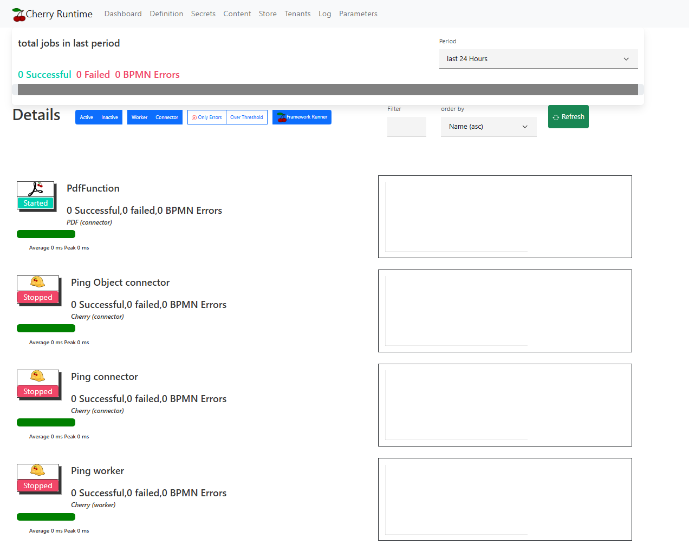
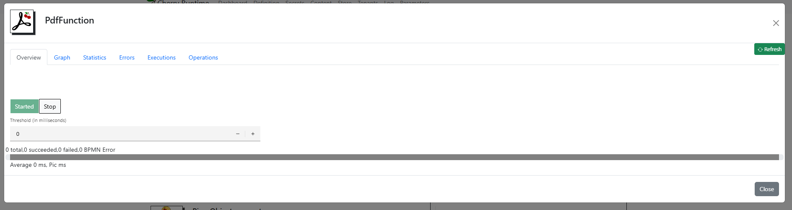
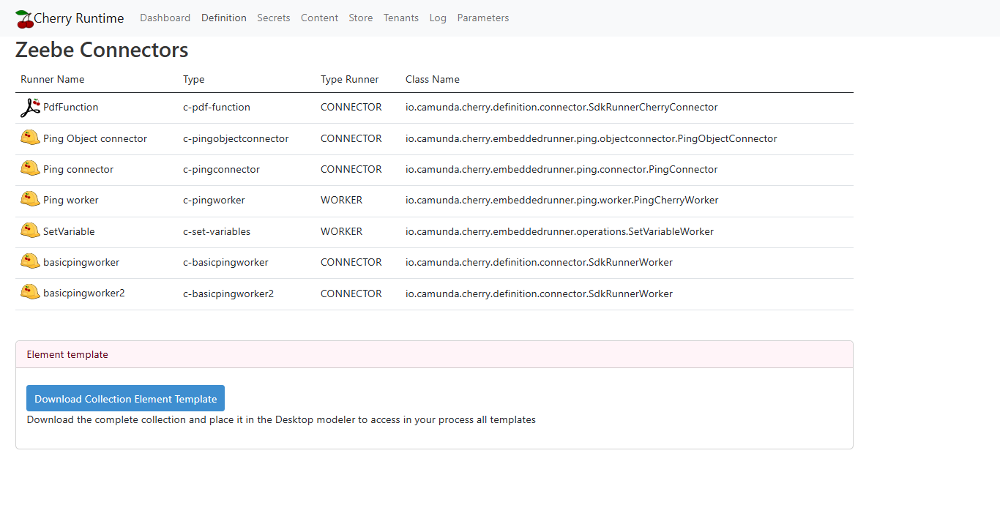
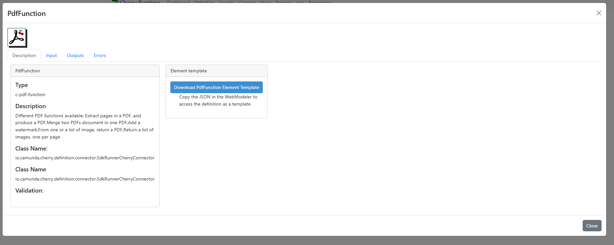
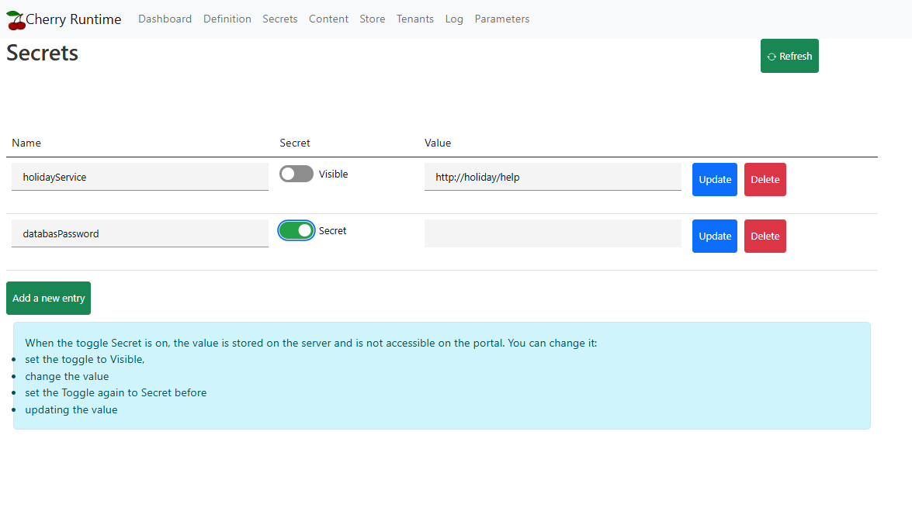
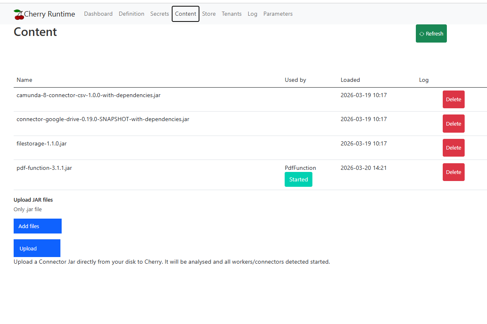
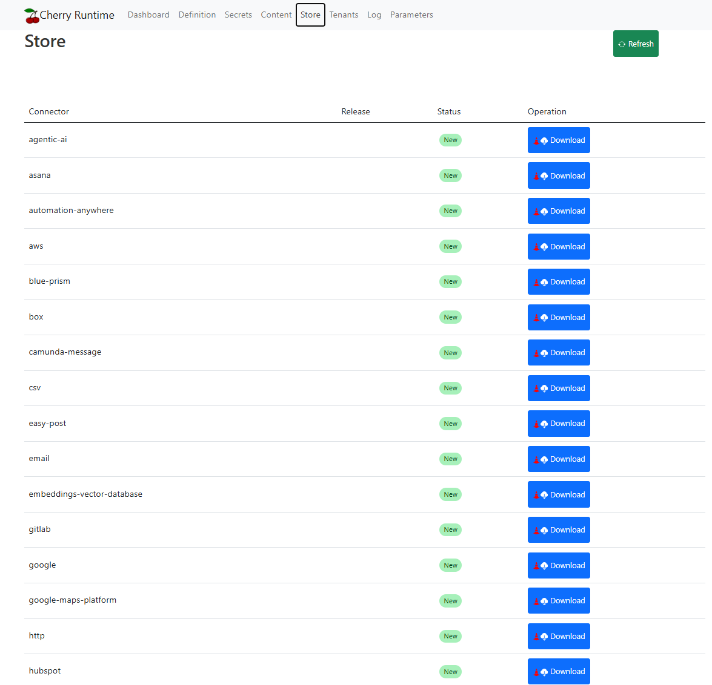
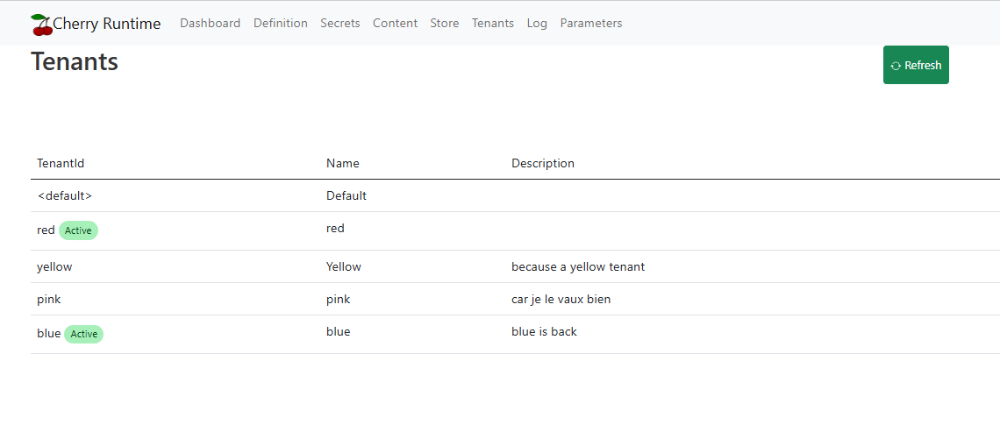
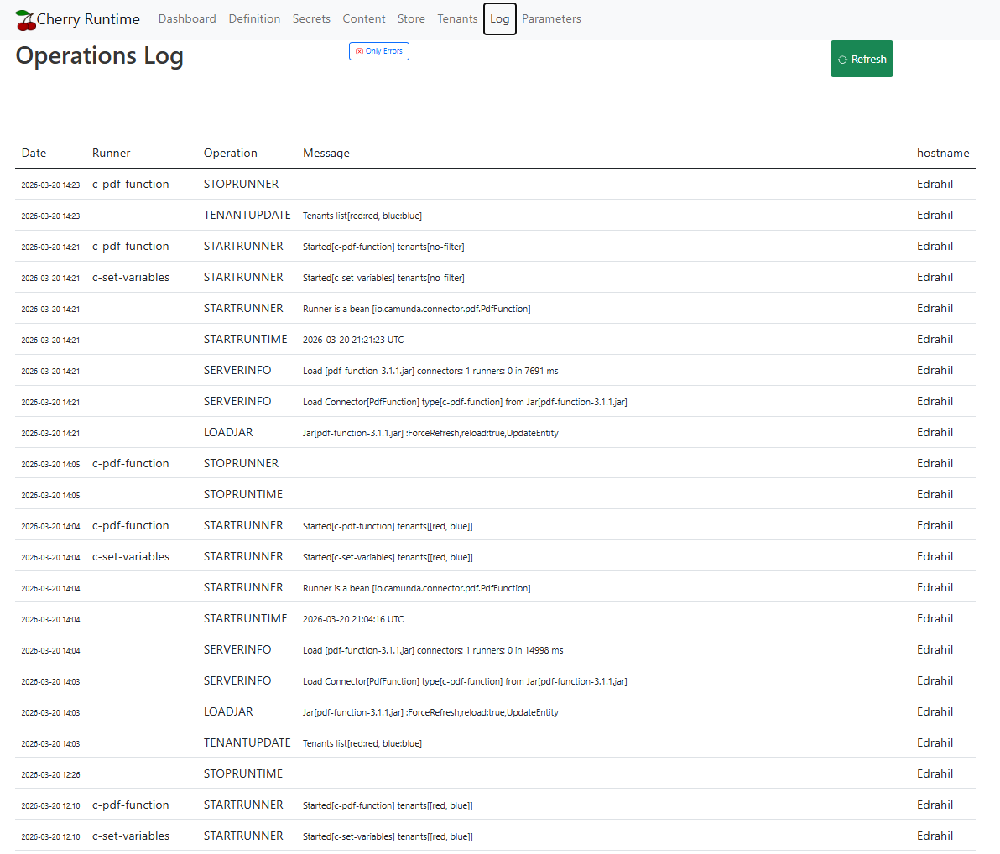
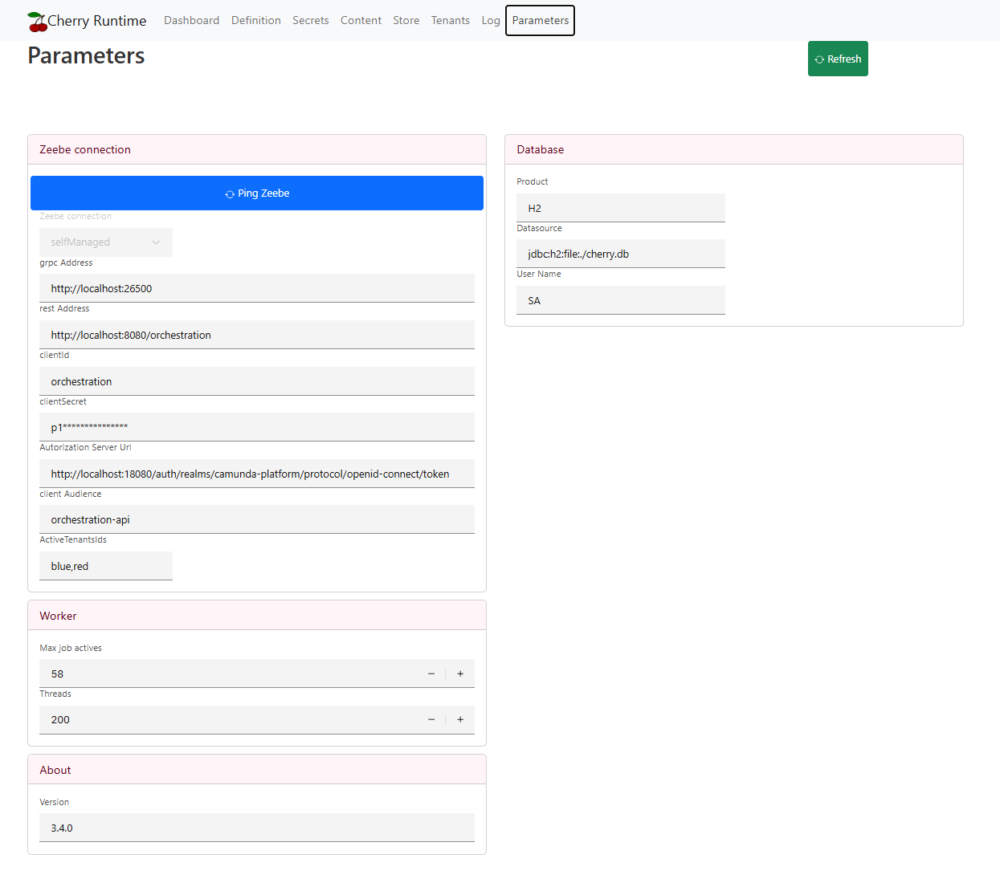

# Administrator guide
the purpose of this document is a guide for the administrator.

# Dashboard






# Definition




# Secrets



# Content


# Store



# Tenants



Cherry dynamically monitor tenants and immediately adapt all runners (workers / connectors) to the new situation.

## New tenants
Cherry check the tenant list every 'refreshTenantsInMinutes' minutes. When a new tenants show up, it verifies if the tenant is in the active list.
* if there is no active list, then the tenant is takes into account
* if the tenant is in the list, it is takes into account.

If the tenant must be used, then Cherry stop all runners, and restart them using the new tenant list.

# Remove a tenant
The same method is used. If the active tenant list change (no active list, or the tenant was in the active list), then all runners are stopped and restarted.


## Limit the tenants list
```yaml
cherry:
  tenants:
    refreshTenantsInMinutes: 1
    activeIds: blue,red

```
In the configuration, it is possible to limit the tenant list. Runners will then accept work only from this list.
If a tenant from the configuration list does not exist, then Cherry does not show that tenant in the list.


# Log




# Parameters




# Configuration

## Load connectors at startup

### Local disk

### Url

## Marketplace

## Private store


# Cherry Database


