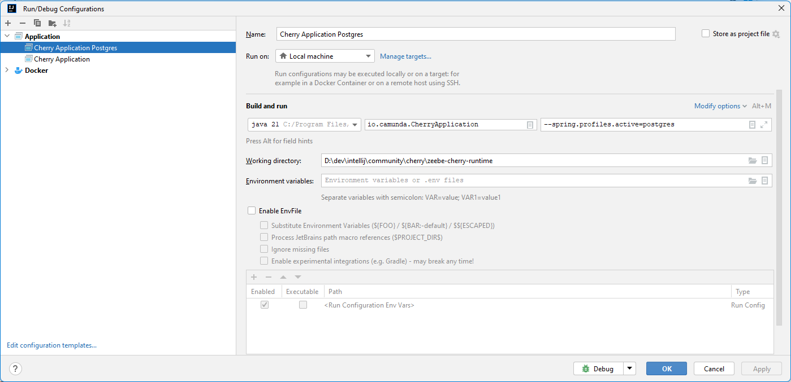
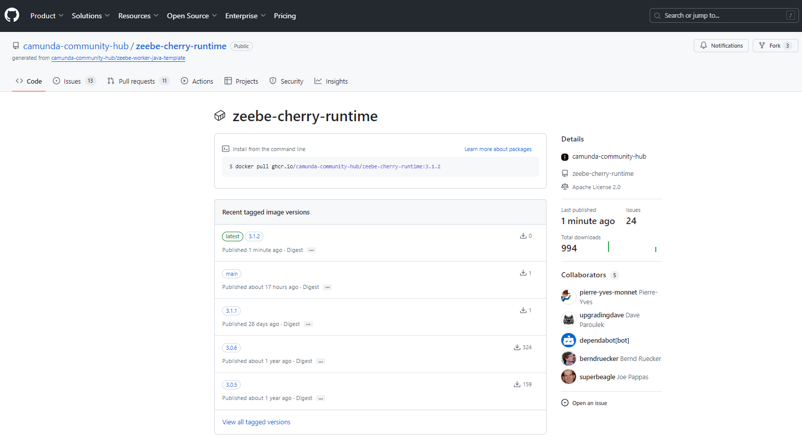

# Cherry Developer
The purpose of the document is to expalin how to develop and publish Cherry


# Running locally
To run locally the runtime, in Intellij for example, check the different topics

## Configuration
In local, you can use a H2 or a Postgres database.
By default, [application.yaml](../../src/main/resources/application.yaml) use an H2 database. 
To use a Postgres database, use the  [application-postgres.yaml](../../src/main/resources/application-postgres.yaml)

In Intellij, use `--spring.profiles.active=postgres`

## Start the runtime
Execute `io.camunda.CherryApplication`



## Debug the UI
To debug the UI, the React part can be start via npm

```shell
cd src/main/frontend
npm start
```


# Build the docker image

Use the command (replace the version by the correct one)
```shell
docker build -t ghcr.io/camunda-community-hub/zeebe-cherry-runtime:3.1.2 .
```

A new image is build. Push the image, and tag it with the `lastest`

```shell
docker tag ghcr.io/camunda-community-hub/zeebe-cherry-runtime:3.1.2 ghcr.io/camunda-community-hub/zeebe-cherry-runtime:latest
docker push ghcr.io/camunda-community-hub/zeebe-cherry-runtime:3.1.2
docker push ghcr.io/camunda-community-hub/zeebe-cherry-runtime:latest
```

Go to https://github.com/camunda-community-hub/zeebe-cherry-runtime/pkgs/container/zeebe-cherry-runtime and check that the last image is correctly updated



