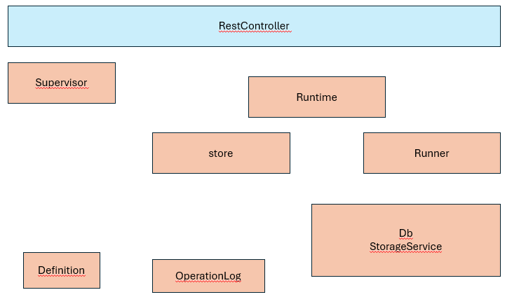

# Cherry architecture

# Overview

## Supervisor

In charge to manage the starter.
- check the configuration, and download all jars referencing in store

The supervisor use the class "installer" to install jar on the runtime.
This installer is used by the RestController when a jar is uploaded from the UI, or when a user want to download and install a jar from a store.

## Runtime

Execute runner.
- secretEnvService and CherrySecretProvider : offer secret inside the runtime
- logOperation : log all operations for an administrator point of view
- historyPerformance and HistoryFactory : manage history tracking
- CherryEngineWrapper 
- OperationFactory
- CherryProperties : load all properties from the propertie file

## Runner

In charge to manage runners.
- inspect Jar to detect runner (RunnerUploadFactory)
- log all operation

## Store

Manage stores
- StoreFactory is  
## db

## Definition

